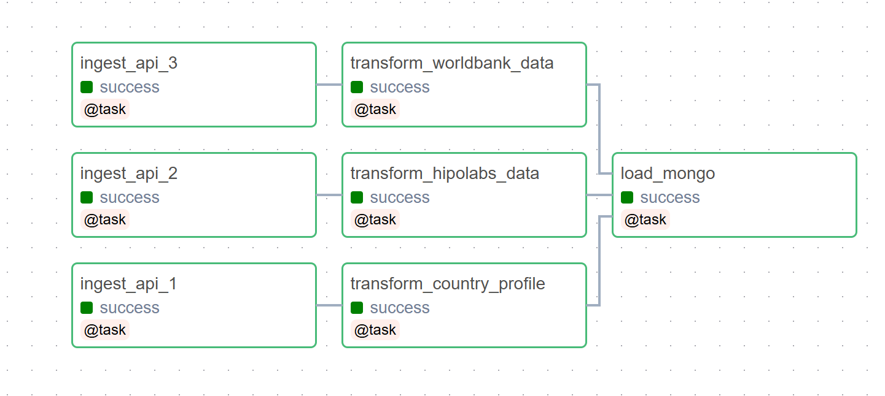
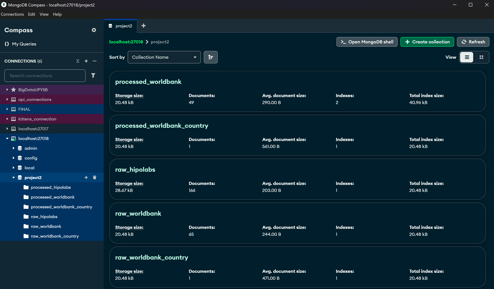

# 🇲🇽 Educational Profile Dashboard – Mexico

**Author:** Valeria Nicol Hernández León  
**Institution:** Universidad Politécnica de Yucatán  
**Teacher:** Gabriel Isaias Salazar Bustillos 
**Course:** Massive Data Management

## Project Overview

This project presents a complete ETL pipeline that integrates, transforms, and visualizes educational data about higher education in Mexico. It utilizes public APIs and presents the insights through a dynamic Streamlit dashboard, enabling users to explore national trends in university enrollment, access, and related socio-economic metrics.

## 🌟 Objectives

Extract structured and semi-structured data from three APIs.

Transform and unify information per Mexican state.

Load cleaned datasets into MongoDB.

Present findings through an interactive and scalable Streamlit dashboard.

Run the complete ETL process using Apache Airflow, ensuring modularity and automation.

## 📁 Folder Structure
```text
etl_valeria/
├── dags
│   └── main_pipeline.py              # Airflow DAG to trigger the ETL pipeline
├── streamlit_app/
│   ├── app.py                        # Streamlit dashboard entry point
│   ├── Dockerfile                    # Dockerfile for Streamlit app
│   ├── requirements.txt              # Python dependencies for Streamlit
│   └── utils/                        # Helper functions for frontend
├── utils/
│   ├── __init__.py                   # Package initializer
│   ├── api_helpers.py                # API calls and response handling
│   ├── mongo_utils.py                # MongoDB read/write operations
│   └── transform_helpers.py          # Data transformation logic
├── .env                              # API keys and secrets
├── docker-compose.yml               # Docker Compose orchestration file
├── Dockerfile.airflow               # Dockerfile for Airflow
├── README.md                         # Project documentation
├── requirements.txt                  # Shared Python dependencies
```

## APIs Used

1. **World Bank API – Tertiary Enrollment**  
   `https://api.worldbank.org/v2/country/MX/indicator/SE.TER.ENRR?format=json&per_page=100`  
   Provides historical data on gross enrollment ratio in tertiary education.

2. **Hipolabs Universities API**  
   `http://universities.hipolabs.com/search?country=Mexico`  
   Returns metadata of higher education institutions in Mexico.

3. **World Bank Country Data API**  
   `http://api.worldbank.org/v2/country/MX?format=json`  
   Supplies general national-level metadata including income level and region.

## Technologies Used

Python 3.11

Apache Airflow – Orchestration and DAG scheduling

MongoDB – NoSQL data storage

Docker + Docker Compose – Containerization of all services

Streamlit – Interactive data visualization

Pandas & Plotly – Data processing and charting

## ETL Process Overview

The data flow is structured in four DAGs, each handling one phase of the ETL process:

Ingestion DAGsFetch raw data from the three APIs and store them in MongoDB collections.

Transformation DAGsNormalize and restructure the data, extract state-level insights, and calculate metrics (e.g., average enrollment, region-based comparisons).

Main PipelineTriggers all ingestion and transformation tasks in a single flow.

Load DAG (Optional)Handles specific post-processing or archival steps if needed.

##  Storage Layer: MongoDB vs PostgreSQL

PostgreSQL is used only for Apache Airflow's internal metadata (task states, DAG runs, logs).

MongoDB is the main storage for both raw and transformed datasets from the APIs.

**Raw collections:**
- `raw_hipolabs`  
- `raw_worldbank`  
- `raw_worldbank_country`  

**Processed collections:**
- `processed_hipolabs`  
- `processed_worldbank`  
- `processed_worldbank_country`  

## 🚀 How to Run

### ✅ Prerequisites

Make sure you have the following installed:

- [Git](https://git-scm.com/download/win) → Check with `git --version`
- [Python 3.x](https://www.python.org/downloads/windows/) → Check with `python --version`
- [Visual Studio Code](https://code.visualstudio.com/)
- [Docker Desktop](https://www.docker.com/products/docker-desktop/)

---

### 🧩 Steps to Run the Project

```bash
# 1. Clone the repository
git clone https://github.com/valnix140405/etl_valeria.git
cd etl_valeria

# 2. Start the services with Docker
docker-compose up --build -d

# 3. (First time only) Initialize Airflow database
docker-compose exec airflow-webserver airflow db init

# 4. Open the project in VS Code (optional)
code .
```
---

### 🌀 Initialize Airflow (First-Time Setup)

Run the following commands **only the first time** you set up the project:

```bash
# Initialize Airflow database
docker-compose exec airflow-webserver airflow db init

# Create Airflow admin user
docker-compose exec airflow-webserver airflow users create \
    --username admin \
    --password admin \
    --firstname Admin \
    --lastname User \
    --role Admin \
    --email admin@example.com
```

### 🧠 Useful Docker Commands

# Stop all containers
```bash
docker-compose down
```
# Restart services without rebuilding
```bash
docker-compose up -d
```
# Rebuild everything from scratch (including volumes)
```bash
docker-compose down --volumes && docker-compose up --build -d
```
## Accessing the Interfaces

Airflow Web UI: http://localhost:8080  
Login: airflow / airflow

Streamlit Dashboard: http://localhost:8501

- MongoDB (optional external access):Port 27017
- MongoDB (optional local access):Port 27018

## Triggering the DAG and Viewing Logs

Access the Airflow UI at localhost:8080

Turn on the DAG named main_pipeline

Trigger the DAG manually or wait for scheduling

Click each task to view logs and XComs

## XCom Usage

The ETL pipeline uses XComs to:

Share record counts between ingestion and transformation tasks

Dynamically log timestamps of data runs

Control conditional branches in the DAG
## 🗂️ ETL Pipeline Overview

This project uses **Apache Airflow** to orchestrate a modular ETL pipeline. The DAG consists of the following tasks:

- `ingest_api_1`, `ingest_api_2`, `ingest_api_3`: Fetch data from 3 different APIs.
- `transform_country_profile`, `transform_hipolabs_data`, `transform_worldbank_data`: Apply data transformations.
- `load_mongo`: Load the final processed data into MongoDB.

The DAG flow is illustrated below:

### 🔁 DAG Structure



## 🧠 MongoDB Collections Overview

After running the ETL pipeline, the data is stored in a local MongoDB instance (`localhost:27018`), using the `project2` database. The collections are organized as follows:

- **Raw data collections**:
  - `raw_worldbank`
  - `raw_worldbank_country`
  - `raw_hipolabs`

- **Processed data collections**:
  - `processed_worldbank`
  - `processed_worldbank_country`
  - `processed_hipolabs`

Each collection contains documents retrieved and transformed from public APIs such as World Bank and Hipolabs. The collections are used as input for data visualization in Streamlit.

### 🗂️ MongoDB Compass Snapshot

This screenshot shows the structure and size of each collection in **MongoDB Compass**:



## 🖼️ Dashboard Preview

Click the image below to watch the video:

[](https://drive.google.com/file/d/19aEVkkjn5o-T9Y5zTGQE2eShWczSZTeP/view?usp=sharing)

## Dashboard Highlights

📍 **Title:** *"Educational Profile Dashboard – Mexico"*

**Main Features:**

- 🇲🇽 **Country Summary**  
  Displays metadata such as:
  - Income level: *Upper middle income*
  - Region: *Latin America & Caribbean*
  - ISO Code: *MEX*

- 🏛️ **Universities Overview**  
  - Total universities: **166**  
  - Each university includes name, domain(s), and direct web link  
  - Search bar to filter by university name

- 🥇 **Top Universities by Domain**  
  Highlights institutions with distinct or multiple web domains, e.g.:  
  - *Universidad Anáhuac* – `anahuac.mx`  
  - *Benemérita Universidad Autónoma de Puebla* – `buap.mx`

- 📊 **Tertiary Enrollment Insights**  
  - Latest enrollment rate (2022): **46.41%**  
  - Historical peak: 46.41% in 2022  
  - Historical low: 5.13% in 1971  
  - +0.76% increase from previous year

- 📈 **Interactive Visualizations**  
  - Time-series chart of enrollment rate  
  - Year range slider for filtering  

- 🗺️ **Featured Universities Map**

   An interactive map built with Plotly and Leaflet highlights the geographical distribution of top universities across Mexico.

   - Each purple marker represents a key university.
   - Hover to view university details.
   - Map dynamically adjusts based on the dataset returned by the Hipolabs API.

   This feature provides a visual perspective on **regional concentration and diversity** in higher education offerings across the country.
